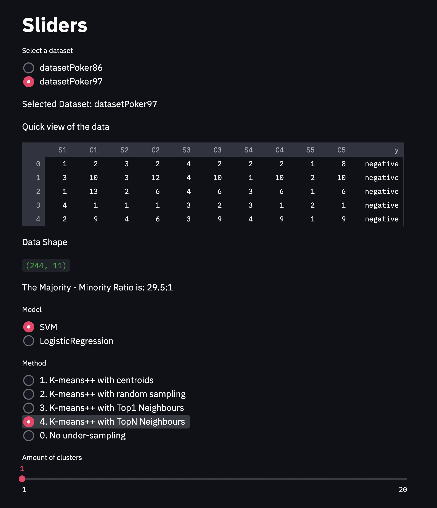
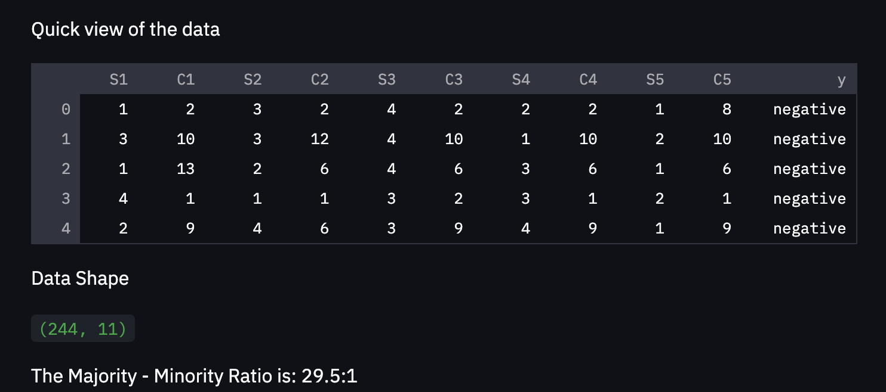
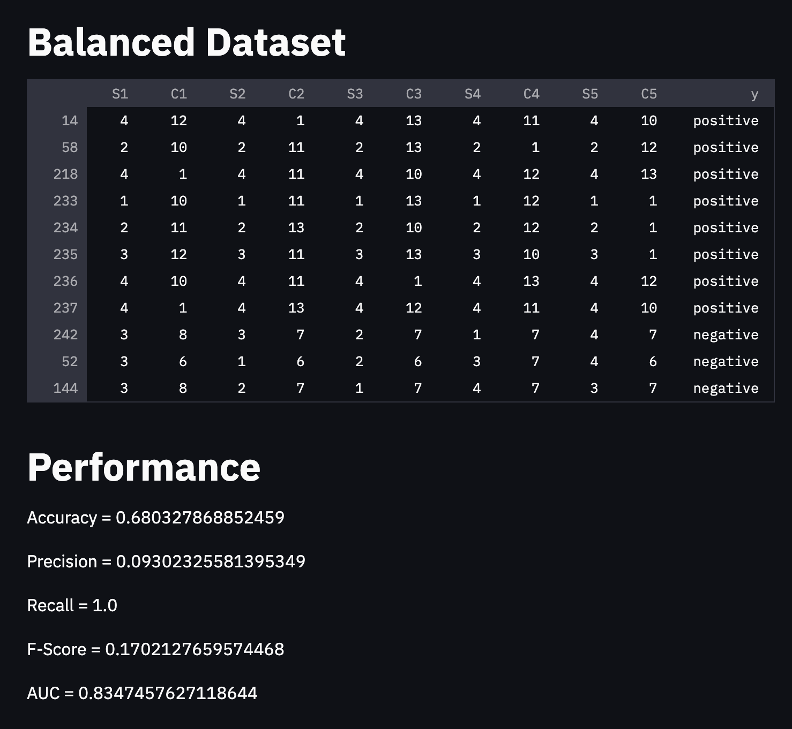

### Welcome
This repository contains my Streamlit implementation of the exercise for the Data Science course in the Goethe University, held by Wiese, L.


## How to use
First clone the repository and then navigate to the root of the project. Then start the streamlit frontend server by using
```
streamlit run main.py
```

Then a new Streamlit app will be available in your browser under port 8501:
```
http://localhost:8501
```

In this app you first find all the sliders that allow us to dynamically view the performance of a certain combination of:
model, under-sampling method, dataset and amount of clusters.

 
Next to that you will also see a small overview of the dataset selected as well as the ratio of the majority class to the
minority class.


Based on the selections for these sliders/ radio buttons the different perfomance metrics show up in the bottom of the page.
